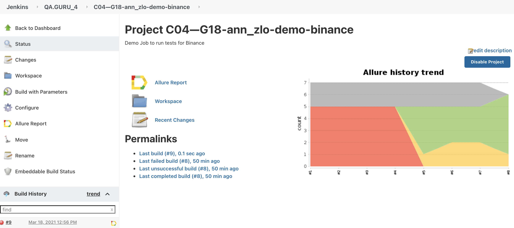
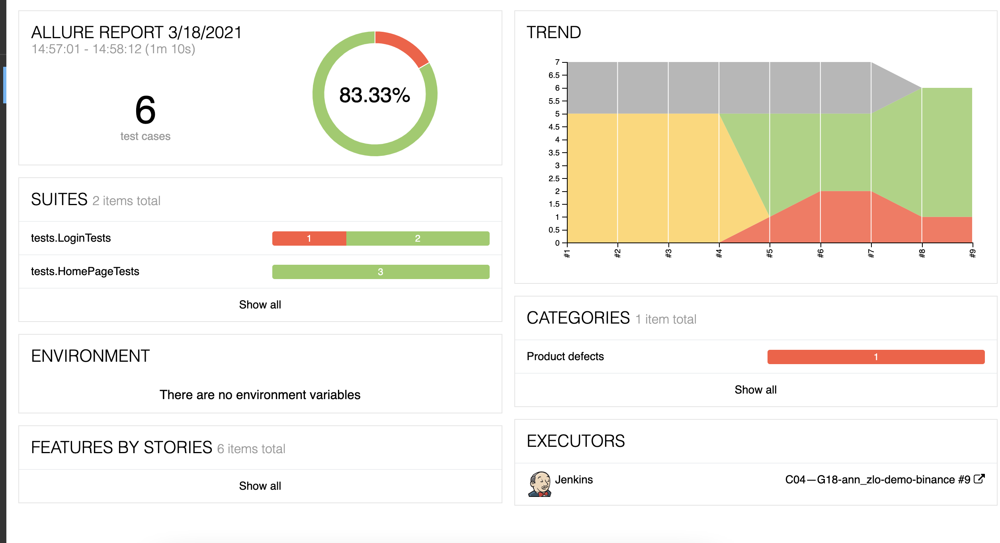
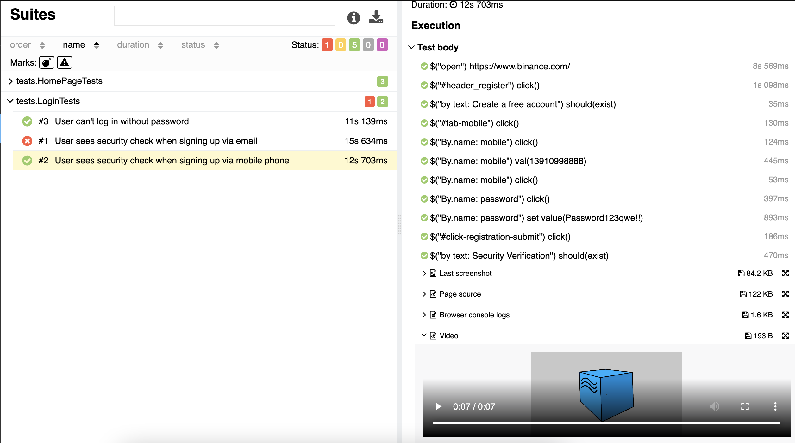
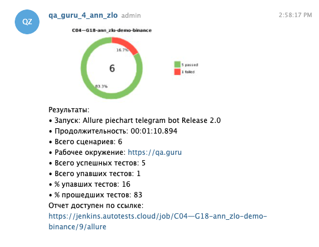
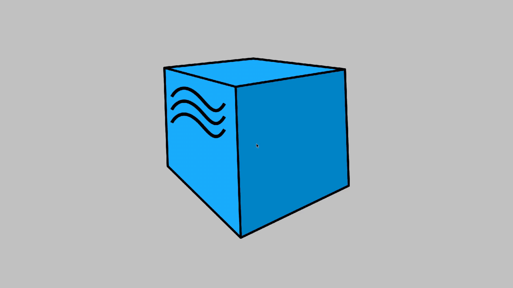

# Project

UI tests for Binance website (https://www.binance.com/en).

## How to run tests

Build tests on your local machine:
`clean test -Denvironment=local`

Build tests in Selenide:
`clean test -Denvironment=selenide`

## Screenshots:

### Jenkins

### Allure

### Telegram

### Video with test

## Technology Stack 

Java, JUnit5, Gradle, Selenide, Allure SE, Selenoid, Jenkins, Telegram Bot

